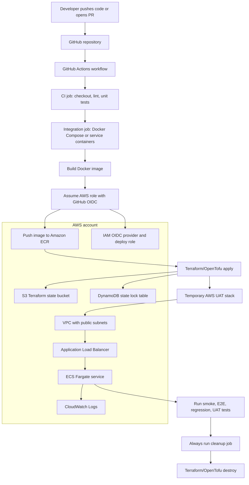

# Low-Cost GitHub Actions to AWS CI/CD Setup

Prepared for: independent developer or small team  
Target: several GitHub repositories deploying containerized apps to AWS  
Recommended stack: GitHub Actions, AWS OIDC, Terraform/OpenTofu, Amazon ECR, Amazon ECS Fargate, CloudWatch

## 1. What You Are Building

You are building a repeatable pipeline that can be copied into multiple GitHub repositories:

1. Run unit tests on every pull request.
2. Run integration tests with local test dependencies.
3. Build a Docker image.
4. Authenticate to AWS without static access keys.
5. Push the image to Amazon ECR.
6. Create a temporary UAT/test environment in AWS.
7. Run smoke, integration, E2E, regression, or UAT tests against the live URL.
8. Destroy the temporary AWS environment in a cleanup job.

The design keeps cost low because GitHub Actions provides the CI/CD control plane and ECS Fargate only runs while your app or test environment is active.

## 2. Architecture Diagram



## 3. Repository Layout

The `starter-kit` folder created beside this document contains copyable templates.

```text
starter-kit/
  architecture.mmd
  .github/workflows/
    app-pipeline.yml
    reusable-aws-ecs-cicd.yml
  infra/
    backend.hcl.example
    main.tf
    outputs.tf
    terraform.tfvars.example
    variables.tf
    versions.tf
  aws/
    task-definition.json
  scripts/
    bootstrap-foundation.sh
    cleanup-environment.sh
    validate-prereqs.sh
  tests/
    README.md
```

For each app repository, copy:

- `.github/workflows/app-pipeline.yml`
- `.github/workflows/reusable-aws-ecs-cicd.yml`
- `infra/`
- `scripts/`

Keep `aws/task-definition.json` only if you want the alternative direct ECS deploy action pattern instead of Terraform-managed deployments.

The same architecture diagram is also saved as `starter-kit/architecture.mmd` so it can be rendered by Mermaid tools or pasted into GitHub Markdown.

## 4. One-Time AWS Setup

Run these steps once per AWS account and GitHub repository.

### 4.1 Install Tools

On your laptop or development machine:

- AWS CLI v2
- Docker Desktop
- Terraform 1.6+ or OpenTofu 1.6+
- Git
- Bash shell
- `jq`

On Windows, run the scripts from Git Bash, WSL, or a Linux/macOS terminal.

Validate:

```bash
cd starter-kit
bash ./scripts/validate-prereqs.sh
```

### 4.2 Configure AWS CLI

Use an IAM user or admin role only for the one-time bootstrap. The pipeline itself will use OIDC and temporary credentials.

```bash
aws configure
aws sts get-caller-identity
```

### 4.3 Bootstrap GitHub OIDC, Deploy Role, ECR, and Terraform State

Set these values:

```bash
export AWS_REGION="us-east-1"
export PROJECT_NAME="myapp"
export GITHUB_OWNER="your-github-user-or-org"
export GITHUB_REPO="your-repo-name"
```

Run:

```bash
cd starter-kit
bash ./scripts/bootstrap-foundation.sh
```

The script creates:

- IAM OIDC provider for `token.actions.githubusercontent.com`
- IAM role named `<project>-github-actions-deploy-role`
- ECR repository named `<project>`
- S3 bucket for Terraform state
- DynamoDB table for Terraform state locking

Copy the script output. You will need these values in GitHub:

- `AWS_ROLE_ARN`
- `TF_STATE_BUCKET`
- `TF_LOCK_TABLE`
- `ECR_REPOSITORY`

## 5. GitHub Repository Configuration

In your GitHub repository, go to:

`Settings -> Secrets and variables -> Actions`

Create this repository secret:

| Name | Example |
|---|---|
| `AWS_ROLE_ARN` | `arn:aws:iam::123456789012:role/myapp-github-actions-deploy-role` |

Create these repository variables:

| Name | Example |
|---|---|
| `AWS_REGION` | `us-east-1` |
| `ECR_REPOSITORY` | `myapp` |
| `TF_STATE_BUCKET` | `myapp-tfstate-123456789012-us-east-1` |
| `TF_LOCK_TABLE` | `myapp-tf-locks` |
| `CONTAINER_PORT` | `8080` |

Optional but recommended:

- Create a GitHub Environment named `uat`.
- For production later, create `production` and require manual approval.

GitHub environments can protect deployment jobs with approvals, branch restrictions, environment-specific secrets, and custom protection rules.

## 6. Application Requirements

Your app repository should contain:

```text
Dockerfile
requirements.txt or package.json or equivalent dependency file
tests/
infra/
.github/workflows/
```

Your Docker container must listen on the same port you configure in GitHub variable `CONTAINER_PORT`.

Example Dockerfile for a Python FastAPI app:

```dockerfile
FROM python:3.12-slim

WORKDIR /app
COPY requirements.txt .
RUN pip install --no-cache-dir -r requirements.txt

COPY . .

ENV PORT=8080
EXPOSE 8080
CMD ["sh", "-c", "uvicorn app.main:app --host 0.0.0.0 --port ${PORT}"]
```

## 7. Pipeline Flow

The provided GitHub Actions workflow does this:

1. `ci`
   - Checks out code.
   - Runs your configured CI command.
   - Uploads reports if the `reports/` folder exists.

2. `build_push`
   - Assumes the AWS role using GitHub OIDC.
   - Logs in to Amazon ECR.
   - Builds the Docker image.
   - Tags it with the Git commit SHA.
   - Pushes it to ECR.

3. `deploy_uat`
   - Initializes Terraform with S3 state and DynamoDB locking.
   - Applies the ECS Fargate UAT environment.
   - Outputs the application URL.

4. `uat_tests`
   - Runs tests against the live deployed URL using `APP_BASE_URL`.

5. `cleanup`
   - Always runs, even if tests fail.
   - Runs `terraform destroy` against the same state key.

## 8. How to Run the First Deployment

1. Copy the `starter-kit` files into your app repository.
2. Edit `.github/workflows/app-pipeline.yml`.
3. Replace `project_name`, `container_port`, and test commands.
4. Commit and push to GitHub.
5. Open the repository's `Actions` tab.
6. Run `Low-cost AWS ECS CI/CD` manually with `workflow_dispatch`.
7. Watch the jobs execute in order.
8. Confirm the cleanup job runs at the end.
9. Check AWS Console for ECS, EC2 load balancers, ECR, CloudWatch logs, and S3 state.

## 9. Cost Controls

Use these defaults for low-cost experimentation:

- Use GitHub-hosted Linux runners first.
- Keep temporary environments short-lived.
- Keep ECS `desired_count = 1` for UAT.
- Use small Fargate task sizes: `256 CPU`, `512 MB`.
- Destroy UAT stacks after every test run.
- Avoid NAT Gateway in early designs; the sample uses public subnets to reduce fixed cost.
- Use ECR lifecycle rules to delete older images.
- Keep GitHub artifact retention short, such as 7 days.
- Set AWS Budgets alerts before experimenting.

Important pricing notes:

- GitHub Actions is free for standard GitHub-hosted runners in public repositories. Private repositories receive included minutes depending on the GitHub plan.
- ECS itself has no extra cluster fee; Fargate charges for vCPU and memory while tasks run.
- Fargate Spot can reduce interrupt-tolerant ECS task cost.
- Public IPv4 addresses on AWS can add cost.
- Application Load Balancers add hourly and LCU cost while they exist, so cleanup matters.

## 10. Security Checklist

Use this before moving beyond UAT:

- Use GitHub OIDC instead of long-lived AWS access keys.
- Restrict the IAM role trust policy to the exact GitHub owner/repo.
- For production, restrict the role to `repo:OWNER/REPO:environment:production`.
- Use GitHub protected environments for production approvals.
- Store app secrets in AWS SSM Parameter Store or Secrets Manager.
- Do not print secrets in workflow logs.
- Pin third-party GitHub Actions to stable versions or SHAs for stricter supply-chain control.
- Add ECR image scanning or a tool such as Trivy before deployment.
- Add AWS Budgets alerts.
- Use separate AWS accounts or at least separate IAM roles for dev, UAT, and production when the project grows.

## 11. Multi-Repository Pattern

For several repositories, use one of these options:

Option A: copy the reusable workflow into every repo. This is easiest for learning.

Option B: create a shared workflow repository such as `your-org/.github` and put `reusable-aws-ecs-cicd.yml` there. Each app repo calls:

```yaml
jobs:
  pipeline:
    uses: your-org/.github/.github/workflows/reusable-aws-ecs-cicd.yml@main
    secrets:
      AWS_ROLE_ARN: ${{ secrets.AWS_ROLE_ARN }}
    with:
      project_name: myapp
      aws_region: ${{ vars.AWS_REGION }}
      ecr_repository: ${{ vars.ECR_REPOSITORY }}
      container_port: 8080
```

Option B is better once two or more repositories need the same pipeline behavior.

## 12. Troubleshooting

### OIDC access denied

Check the IAM role trust policy. The `sub` value must match your GitHub repository and branch or environment.

For a repo-wide beginner setup:

```text
repo:OWNER/REPO:*
```

For a production environment:

```text
repo:OWNER/REPO:environment:production
```

### Terraform state lock error

Confirm `TF_STATE_BUCKET`, `TF_LOCK_TABLE`, and `AWS_REGION` are correct in GitHub variables.

### ECS service never becomes healthy

Check:

- Container listens on `0.0.0.0`, not `localhost`.
- Container port matches `CONTAINER_PORT`.
- Health check path in Terraform matches your app.
- CloudWatch logs for startup errors.

### Cleanup failed

Run the manual cleanup script:

```bash
export AWS_REGION="us-east-1"
export TF_STATE_BUCKET="your-state-bucket"
export TF_LOCK_TABLE="your-lock-table"
export TF_STATE_KEY="uat/myapp/1234567890.tfstate"
export PROJECT_NAME="myapp"
export ENVIRONMENT="uat-1234567890"
export IMAGE_URI="123456789012.dkr.ecr.us-east-1.amazonaws.com/myapp:any-existing-tag"

cd starter-kit
bash ./scripts/cleanup-environment.sh
```

## 13. References

- GitHub Actions billing and usage: https://docs.github.com/en/actions/learn-github-actions/usage-limits-billing-and-administration
- GitHub OIDC for AWS: https://docs.github.com/en/actions/how-tos/secure-your-work/security-harden-deployments/oidc-in-aws
- AWS configure credentials GitHub Action: https://github.com/aws-actions/configure-aws-credentials
- GitHub reusable workflows: https://docs.github.com/en/actions/reference/workflows-and-actions/reusable-workflows
- GitHub deployments and environments: https://docs.github.com/en/actions/reference/deployments-and-environments
- Amazon ECS deploy task definition action: https://github.com/aws-actions/amazon-ecs-deploy-task-definition
- Amazon ECS pricing: https://aws.amazon.com/ecs/pricing/
- AWS Fargate pricing: https://aws.amazon.com/fargate/pricing/
- Amazon ECR pricing: https://aws.amazon.com/ecr/pricing/
- AWS public IPv4 charge: https://aws.amazon.com/blogs/aws/new-aws-public-ipv4-address-charge-public-ip-insights/
- Terraform AWS provider: https://registry.terraform.io/providers/hashicorp/aws/latest/docs
- OpenTofu documentation: https://opentofu.org/docs/
